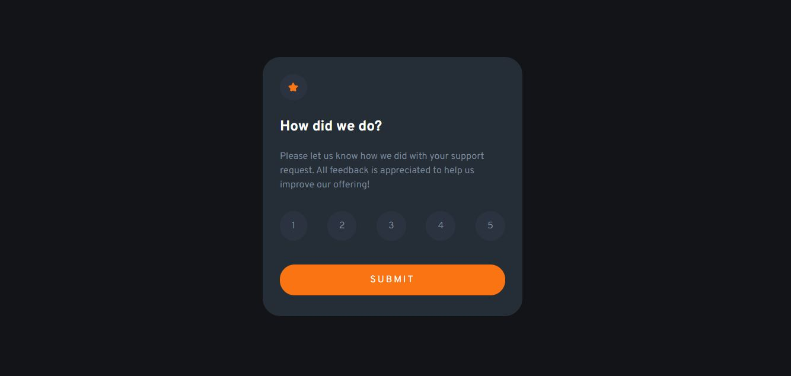
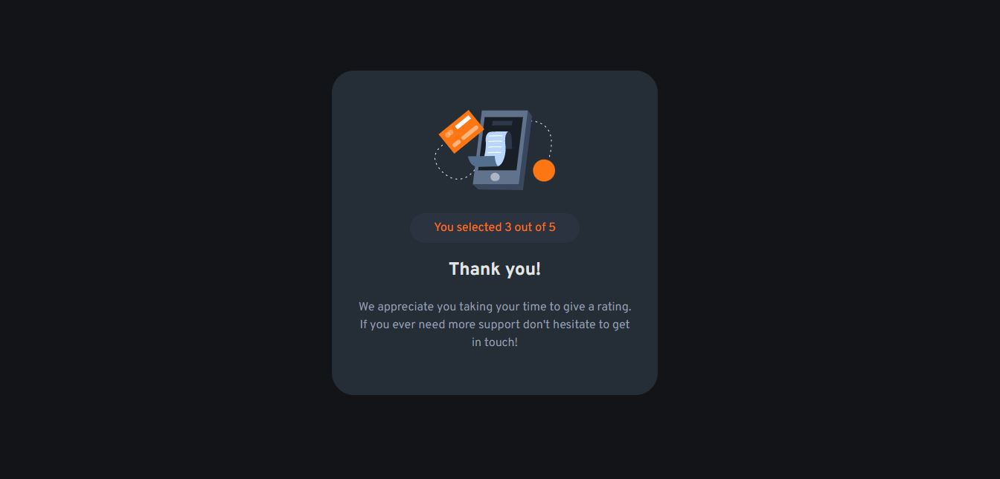
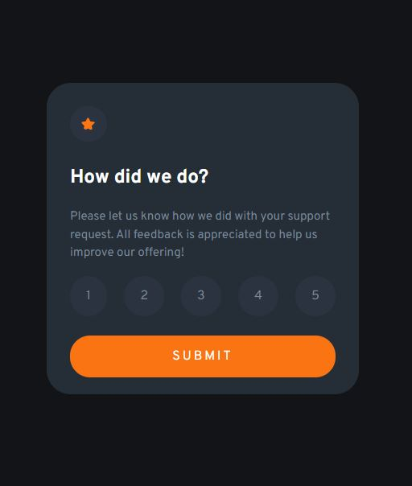
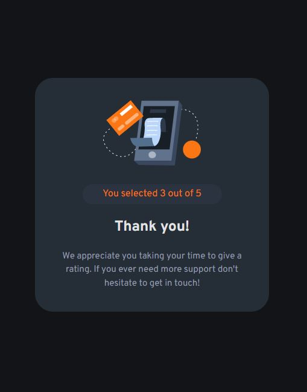

# Frontend Mentor - Interactive rating component solution 

## Table of contents

- [Overview](#overview)
  - [The challenge](#the-challenge)
  - [Screenshot](#screenshot)
  - [Links](#links)
  - [Built with](#built-with)
  - [Continued development](#continued-development)
- [Author](#author)

## Overview

This is a solution to the [Interactive rating component challenge on Frontend Mentor](https://www.frontendmentor.io/challenges/interactive-rating-component-koxpeBUmI). Frontend Mentor challenges help you improve your coding skills by building realistic projects.
I created this project using Reactjs(Vite-app)

### The challenge

Users should be able to:

- View the optimal layout for the app depending on their device's screen size
- See hover states for all interactive elements on the page
- Select and submit a number rating
- See the "Thank you" card state after submitting a rating

### Screenshot

### Links

- Solution URL: [GitHub](https://github.com/thisisadelakun/Interactive_rating)
- Live Site URL: [GoLive](https://your-live-site-url.com)

### Built with

- Semantic HTML5 markup
- CSS custom properties
- Flexbox
- Mobile-first workflow
- [React](https://reactjs.org/) - JS library
- [Vite](https://vitejs.dev/guide/)

### Continued development

I will continue to focus on Javascript functions in future projects.

## Author

- Website - [Adelakun Abayomi](https://adelakunportfolio.netlify.app/)
- Frontend Mentor - [@thisisadelakun](https://www.frontendmentor.io/profile/thisisadelakun)
- Twitter - [@thisisadelakun](https://www.twitter.com/thisisadelakun)

